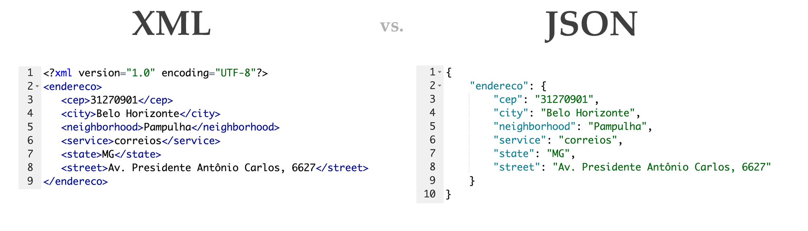
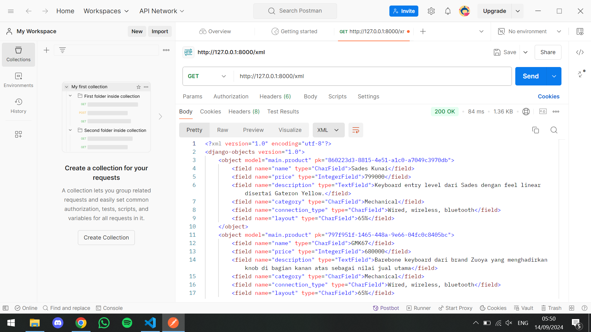
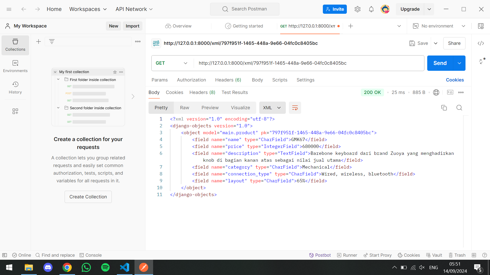
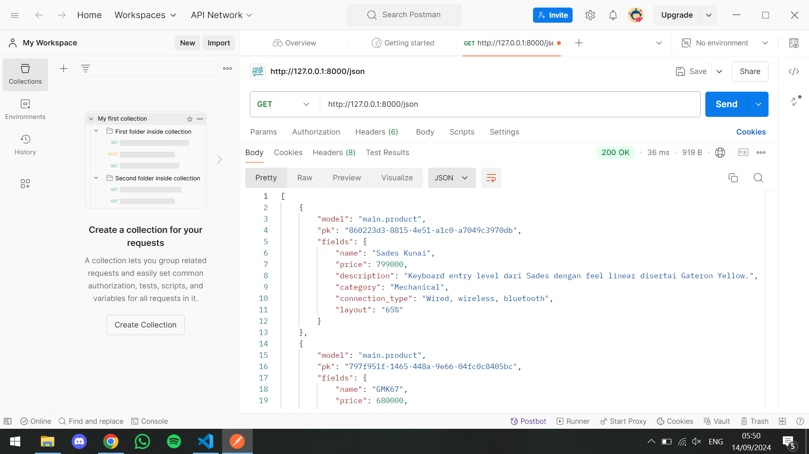
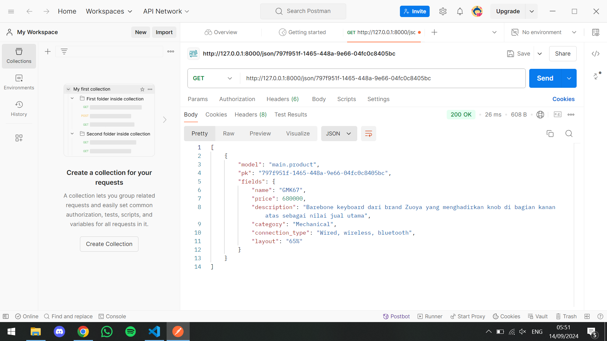

# Depok Keebs
Mau keyboard yang tak hanya enak dilihat tapi juga enak dipakai? Depok Keebs siap mewujudkan keyboard impianmu. Ucapkan selamat tinggal pada keyboard standar dan mulailah menciptakan pengalaman mengetik yang berbeda dengan kami.
Link PWS: [Depok Keebs](http://rayhan-syahdira-depokkeebs.pbp.cs.ui.ac.id/)


<details>
<summary> <b> Tugas 2: Implementasi Model-View-Template (MVT) pada Django </b> </summary>

    
## **Pertanyaan 1**  
**Step-by-step implementasi checklist Tugas 2:**

1. Saya membuat direktori lokal di laptop saya bernama `depok_keebs`.
2. Saya membuat repository di GitHub dengan nama yang sama, yaitu `depok_keebs`.
3. Saya menginisiasi direktori lokal dengan `git`, kemudian menambahkan remote repository `depok_keebs` agar terhubung dengan repository lokal.
4. Saya membuat file-file syarat seperti `.gitignore` dan `README.md`, kemudian menginstal dependencies.
5. Setelah memulai virtual environment, saya membuat project Django baru dengan `django-admin startproject depok_keebs .`.
6. Saya memulai app baru bernama `main` dengan `python manage.py startapp main`.
7. Saya meng-*include* aplikasi dan URL `main` pada `settings.py` dan `urls.py` di direktori project, setelah itu juga menambahkan URL pada level aplikasi `main`, sehingga Django bisa me-*handle* pola URL yang akan diberikan.
8. Saya membuat direktori `templates` di dalam direktori `main`, lalu membuat `main.html` yang berisi template data diri dan nama aplikasi untuk menampilkan layout page pada web PWS.
9. Saya membuat model `Product` dengan beberapa atribut, yaitu `name`, `price`, `description`, `category`, `connection_type`, dan `layout`.
10. Setelah `models.py` selesai dikerjakan, saya melakukan migrasi models.
11. Pada `views.py` dalam aplikasi `main`, saya mengimplementasikan fungsi untuk menampilkan template HTML.
12. Saya membuat project baru pada PWS lalu menambahkan git remote PWS pada direktori lokal saya.
13. Setelah direktori lokal selesai saya kerjakan, saya melakukan *commit* dan *push* perubahan ke GitHub repository `depok_keebs` dan juga PWS.
14. Project PWS selesai build, kemudian saya melengkapi `README.md` pada GitHub repository.


## **Pertanyaan 2**  
**Buatlah bagan yang berisi request client ke web aplikasi berbasis Django beserta responnya dan jelaskan pada bagan tersebut kaitan antara urls.py, views.py, models.py, dan berkas HTML:**

1. User mengirim HTTP request ke PWS server yang diteruskan ke WSGI server.
2. WSGI server meneruskan ke Django.
3. Oleh `urls.py`, HTTP request dihubungkan ke `views.py`.
4. Selanjutnya, `views.py` memproses request dan *fetch* data dari `models.py`.
5. `views.py` mengirimkan response HTTP berupa template `main.html` kembali pada User.


## **Pertanyaan 3**  
**Jelaskan fungsi git dalam pengembangan perangkat lunak:**

Git berfungsi sebagai *version control* dalam pengembangan perangkat lunak. Dengan Git, kita dapat melacak setiap perubahan kode yang dilakukan, memudahkan proses kolaborasi, dan memungkinkan *rollback* ke versi sebelumnya jika terjadi kesalahan.


## **Pertanyaan 4**  
**Menurut Anda, dari semua framework yang ada, mengapa framework Django dijadikan permulaan pembelajaran pengembangan perangkat lunak:**

Dengan arsitektur *Model-View-Template (MVT)* yang terstruktur, framework ini membantu pemula memahami konsep dasar pengembangan web sambil mengajarkan praktik terbaik dalam hal keamanan, manajemen database, dan skalabilitas. Selain itu, komunitasnya yang besar juga menyediakan dukungan dan sumber daya yang melimpah terutama bagi mahasiswa yang memulai pembelajaran ini.


## **Pertanyaan 5**  
**Mengapa model pada Django disebut sebagai ORM:**

*Object-Relational Mapping* (ORM) adalah sebuah teknik untuk me-*convert* sebuah object menjadi object pada sistem lain. Models pada Django disebut sebagai ORM karena Django berperan sebagai interface antara object pada Python dengan tabel pada SQL. Ini memungkinkan pengembang untuk berinteraksi dengan database tanpa harus menulis query SQL secara eksplisit, melalui *QuerySet API* yang disediakan oleh Django.
</details>

<details>
 
<summary> <b> Tugas 3: Implementasi Form dan Data Delivery pada Django </b> </summary>

 
## **Pertanyaan 1**  
**Jelaskan mengapa kita memerlukan data delivery dalam pengimplementasian sebuah platform:**

Pengimplementasian sebuah platform memerlukan data delivery untuk mengirim data secara cepat antar komponen sistem. Data delivery memungkinkan monitoring analitik untuk membantu optimasi platform dan pengambilan keputusan berbasis data. Dalam platform dengan jumlah pengguna besar, data delivery yang efektif memungkinkan sistem untuk menangani traffic data tinggi.


## **Pertanyaan 2**  
**Menurutmu, mana yang lebih baik antara XML dan JSON serta mengapa JSON lebih populer dibandingkan XML:**


Menurut saya, JSON mengungguli XML di beberapa bidang. Secara struktur dan ukuran, data JSON lebih compact dibanding XML, dan JSON lebih terintegrasi dengan berbagai bahasa pemrograman modern seperti JavaScript. Karena formatnya yang lebih sederhana, JSON lebih cepat diparsing daripada XML. Alasan-alasan tersebut cukup untuk membuat JSON lebih populer dibandingkan XML.


## **Pertanyaan 3**  
**Jelaskan fungsi dari method is_valid() pada form Django dan mengapa kita membutuhkan method tersebut:**

`form.is_valid()` digunakan untuk memeriksa apakah data yang dikirimkan melalui form memenuhi syarat validasi yang telah ditentukan. Fungsi ini akan mengembalikan nilai **True** jika semua data valid, dan **False** jika ada error atau data tidak valid. Django akan memeriksa setiap field dalam form sesuai dengan aturan validasi yang telah didefinisikan di model atau secara manual di form itu sendiri. Dalam konteks Depok Keebs, fungsi ini akan mengecek apakah form entry field seperti `name`, `price`, `description`, hingga `layout` telah memenuhi syarat validasi.


## **Pertanyaan 4**  
**Mengapa kita membutuhkan csrf_token saat membuat form di Django dan apa yang dapat terjadi jika kita tidak menambahkan csrf_token pada form Django? Bagaimana hal tersebut dapat dimanfaatkan oleh penyerang:**

Kita membutuhkan `csrf_token` untuk melindungi aplikasi dari serangan Cross-Site Request Forgery (CSRF). CSRF adalah jenis serangan di mana penyerang mencoba melakukan aksi yang tidak diinginkan atas nama pengguna yang sah tanpa sepengetahuan mereka. Setiap kali form HTML dikirimkan melalui metode POST, Django mengharapkan adanya `csrf_token` yang unik untuk sesi pengguna saat ini. Django kemudian memverifikasi bahwa token ini cocok dengan yang diharapkan untuk sesi pengguna tersebut. Jika token tidak cocok atau tidak ada, permintaan akan ditolak. 
Jika tidak menyertakan `csrf_token` dalam form Django, secara default Django akan memblokir semua permintaan POST dengan error **403 Forbidden**. Lalu, aplikasi akan menjadi rentan terhadap serangan CSRF. Penyerang dapat memanfaatkan absennya `csrf_token` ini dengan membuat halaman berbahaya yang mengirimkan permintaan POST ke aplikasi web yang sah atas nama pengguna yang sedang login.


## **Mengakses URL dengan Postman**




</details>

<details>
 
<summary> <b> Tugas 4: Implementasi Autentikasi, Session, dan Cookies pada Django </b> </summary>

    
**Implementasi checklist Tugas 4:**

**Jelaskan bagaimana cara kamu mengimplementasikan checklist di atas secara step-by-step (bukan hanya sekadar mengikuti tutorial):**

1. Untuk membuat fungsi register, pertama tambahkan import `UserCreationForm` di `views.py` dan implementasi fungsi `register`
2. Tambahkan `register.html` di `main/templates` yang akan menjadi template untuk form register
3. Routing URL ke `urls.py` yang mengarah ke fungsi `register`
4. Untuk membuat fungsi login, tambahkan import `authenticate`, `login`, dan `AuthenticationForm` dan implementasi fungsi `login_user` di `views.py`
5. Tambahkan `login.html` di `main/templates` yang akan menjadi template form login
6. Sama dengan sebelumnya, routing URL ke `urls.py` yang mengarah ke fungsi `login_user`
7. Untuk membuat fungsi logout, tambahkan import `logout` dan implementasi fungsi `logout_user`
8. Buat tombol logout dengan menambahkan blok kode berikut di bawah hyperlink Add Product
   ```html
   <a href="">
   <button>Logout</button>
   </a>
   ```
9. Routing URL ke `urls.py` yang mengarah ke fungsi `logout_user`
10. Untuk membuat aplikasi memerlukan login sebelum menuju halaman main, import `login_required` dan tambahkan `@login_required(login_url='/login')` di baris atas fungsi `show_main` pada `views.py`
11. Sekarang, coba jalankan server dan melakukan register untuk membuat user baru. Kemudian, login dengan username dan password yang dibuat
12. Buat Product baru dengan Add New Product sebanyak 3 buah.
13. Untuk menghubungkan Product dengan User, import `User` ke `models.py` dan tambahkan variabel `user` dengan ForeignKey dengan `on_delete=models.CASCADE` (agar ketika user dihapus, Product bersangkutan akan terhapus juga) dalam `context`
14. Modifikasi fungsi `create_product_entry` di `views.py` untuk mencegah Django menyimpan objek Product yang telah dibuat ke dataabase, melainkan ke user
15. Dalam fungsi `show_main`, ubah variabel `product_entries` dari yang semula menampilkan semua objek dalam database menjadi difilter menurut user yang sedang aktif
16. Simpan perubahan dengan `makemigrations` dan `migrate`
17. Untuk menampilkan user yang sedang login dan menambahkan cookies seperti last login, tmbahkan import `HttpResponseRedirect`, `reverse`, dan `datetime` di `views.py`
18. Ganti blok kode `login_user/if form.is_valid()` dengan:
    ```python
    if form.is_valid():
    user = form.get_user()
    login(request, user)
    response = HttpResponseRedirect(reverse("main:show_main"))
    response.set_cookie('last_login', str(datetime.datetime.now()))
    return response
    ```
19. Dalam `context` di fungsi `show_main`, tambahkan variabel `last_login` dengan value `request.COOKIES['last_login']`
20. Tambahkan `response.delete_cookie('last_login')` di fungsi `logout_user` yang berfungsi untuk menghapus cookie last_login saat pengguna melakukan logout
21. Tunjukkan informasi last login dengan menambahkan `<h5>Sesi terakhir login: {{ last_login }}</h5>` setelah tombol logout pada `main.html`

    
## **Pertanyaan 1**
**Apa perbedaan antara `HttpResponseRedirect()` dan `redirect()`:**

`HttpResponseRedirect()` adalah kelas Django yang digunakan untuk membuat respons HTTP dengan kode status 302 (redirect). Saat menggunakan ini, kita harus memberikan URL tujuan secara eksplisit, baik dalam bentuk string URL lengkap atau menggunakan `reverse()` untuk mendapatkan URL dari nama rute. Fungsinya murni hanya untuk mengalihkan pengguna ke URL lain tanpa fitur tambahan.
`redirect()` adalah fungsi utilitas Django yang lebih sederhana dan fleksibel. Ini dapat menerima berbagai jenis argumen seperti URL, nama rute, atau objek model. Django akan secara otomatis menangani konversi argumen ini menjadi URL yang benar. `redirect()` adalah cara yang lebih umum digunakan karena lebih mudah dan memiliki kemampuan tambahan dibandingkan `HttpResponseRedirect()`.


## **Pertanyaan 2**
**Jelaskan cara kerja penghubungan model `Product` dengan `User`:**

Cara kerja penghubungan model Product dengan User di Django bekerja melalui konsep ForeignKey, yang memungkinkan satu entitas (dalam hal ini, Product) berelasi dengan satu entitas lainnya (User). Berikut cara kerjanya secara bertahap:
1. Pada model Product, kita menambahkan field user yang merupakan ForeignKey ke model User. Ini berarti setiap entri product dihubungkan secara langsung ke satu pengguna.
2. Di dalam views, ketika pengguna mengirim form untuk membuat entri baru, kita tidak langsung menyimpan data ke database. Alih-alih, kita menahan proses simpan dengan `commit=False`, yang memungkinkan kita menambahkan informasi tambahan sebelum data disimpan ke database.
3. Ketika menampilkan data di halaman utama, kita hanya menampilkan Product yang dibuat oleh pengguna yang sedang login. Ini dilakukan dengan menggunakan metode `filter()`, di mana kita menyaring data Product yang user-nya sesuai dengan `request.user`.
Dengan menambahkan ForeignKey di model, mengisi field user saat menyimpan, dan menyaring data berdasarkan pengguna yang sedang login, Django secara otomatis mengelola hubungan antara productEntry dan User, sehingga setiap entri product selalu terkait dengan pengguna yang membuatnya.


## **Pertanyaan 3**
**Apa perbedaan antara authentication dan authorization, apakah yang dilakukan saat pengguna login? Jelaskan bagaimana Django mengimplementasikan kedua konsep tersebut:**

Authentication adalah proses verifikasi identitas pengguna, memastikan bahwa pengguna yang mencoba mengakses sistem adalah siapa yang mereka klaim. Di Django, autentikasi dilakukan saat pengguna login, di mana kredensial seperti username dan password diverifikasi dengan data yang tersimpan di database.
Authorization, di sisi lain, adalah proses yang mengatur apa yang dapat dilakukan pengguna setelah terautentikasi. Django menggunakan sistem permissions untuk mengontrol akses pengguna ke berbagai sumber daya atau fungsi dalam aplikasi. Misalnya, hanya pengguna tertentu yang dapat menambah atau mengedit data berdasarkan izin yang diberikan. Dekorator seperti `@login_required` dan `@permission_required` digunakan untuk membatasi akses berdasarkan status login atau izin spesifik yang dimiliki pengguna.


## **Pertanyaan 4**
**Bagaimana Django mengingat pengguna yang telah login? Jelaskan kegunaan lain dari cookies dan apakah semua cookies aman digunakan:**

Django menyimpan status login pengguna dengan menggunakan session di server dan mengirimkan cookie sessionid ke browser pengguna untuk melacak session tersebut. Setiap kali pengguna mengunjungi halaman lain, cookie ini digunakan untuk mengidentifikasi session pengguna di server, sehingga Django dapat mengenali siapa yang sedang login. Selain untuk login, cookies juga berfungsi menyimpan preferensi pengguna dan untuk tujuan analitik, tetapi penggunaannya tidak selalu aman. Cookies rentan terhadap serangan seperti XSS atau pembajakan session, sehingga penting untuk mengaktifkan flag HttpOnly dan Secure guna memastikan cookies lebih aman.
</details>

<details>
 
<summary> <b> Tugas 5: Desain Web menggunakan HTML, CSS dan Framework CSS </b> </summary>


**Implementasi checklist Tugas 5:**

**Jelaskan bagaimana cara kamu mengimplementasikan checklist di atas secara step-by-step (bukan hanya sekadar mengikuti tutorial):**

1. Untuk membuat tombol edit dan delete, saya membuat fungsi baru pada `views.py` dengan nama `edit_product` dan `delete_product`.
2. Implementasikan fungsi `edit_product` dengan kode:
   ```
    def edit_product_entry(request, id):
        product_entry = Product.objects.get(pk=id)
        form = ProductEntryForm(request.POST or None, instance=product_entry)

        if form.is_valid() and request.method == "POST":
            form.save()
            return redirect('main:show_main')

        context = {'form': form}
        return render(request, "edit_product_entry.html", context)
    ```
3. Implementasikan fungsi `delete_product` dengan kode:
   ```
   def delete_product(request, id):
        product_entry = Product.objects.get(pk=id)
        product_entry.delete()
        return redirect('main:show_main')
   ```
4. Saya membuat `edit_product.html` dan menghias tampilannya dengan bawaan `base.html`
5. Setelah kedua fungsi dibuat dan diimplementasikan, kedua fungsi dirouting URL ke `urls.py` dengan URL untuk edit sebagai `/edit-product/[id]` dan untuk delete product sebagai `/delete/[id]`
6. Untuk kustomisasi `register.html`, saya menerapkan beberapa perubahan:
   Tombol register
   ```html
   <button type="submit" class="group relative w-full flex justify-center py-2 px-4 border border-transparent text-sm font-    medium rounded-md text-white bg-[#6A9AB0] hover:bg-[#5C869A] focus:outline-none focus:ring-2 focus:ring-offset-2             focus:ring-indigo-500">
      Register
   </button>
   ```
7. Untuk kustomisasi `login.html`, saya menerapkan beberapa perubahan:
   Kustomisasi tombol sign in dan input styling
   ```html
   <button type="submit" class="group relative w-full flex justify-center py-2 px-4 border border-transparent text-sm font-    medium rounded-md text-white bg-[#6A9AB0] hover:bg-[#5C869A] focus:outline-none focus:ring-2 focus:ring-offset-2             focus:ring-indigo-500">
      Sign in
    </button>

   <input id="username" name="username" type="text" required class="appearance-none rounded-none relative block w-full px-        3 py-2 border border-yellow-400 placeholder-yellow-400 text-black rounded-t-md focus:outline-none focus:ring-yellow-        500         focus:border-yellow-500 focus:z-10 sm:text-sm" placeholder="Username">
    ```
8. Untuk kustomisasi `create_product_entry.html`, saya menerapkan beberapa perubahan:
   Kustomisasi tombol New Product dan navbar positioning
   ```html
   <div class="flex justify-end mb-6">
      <a href="" class="bg-[#6A9AB0] hover:bg-[#5C869A] text-white font-bold py-2 px-4         rounded-lg transition duration-300 ease-in-out transform hover:-translate-y-1 hover:scale-105">
        + Add New Product Entry
          </a>
        </div>

    <!-- Input form styling -->
    <input type="text" name="product_name" class="appearance-none block w-full px-3 py-2 border border-gray-300 rounded-md     shadow-sm placeholder-gray-400 focus:outline-none focus:ring-indigo-500 focus:border-indigo-500 sm:text-sm">
    ```
9. Jika belum ada produk tersimpan, gambar `sedih-banget.png` dan pesan "Belum ada data product akan ditampilkan dengan baris kode ini yang berada di `main.html`:
    ```html
    
    <div class="flex flex-col items-center justify-center min-h-[24rem] p-6">
      
      <p class="text-center text-white mt-4 bg-[#6A9AB0] p-4 rounded-lg shadow-md">
        Belum ada data product...
      </p>
    </div>
    
    ```
10. Jika sudah ada produk tersimpan, produk akan ditampilkan di halaman utama sebagai card.
    ```html
    
    <div class="grid grid-cols-1 sm:grid-cols-2 lg:grid-cols-4 gap-4 px-4">
      
        
      
    </div>
    
    ```
11. Untuk button edit dan delete, keduanya akan diletakkan di `product_card.html` dengan implementasi:
```html
    <div class="relative break-inside-avoid w-72 h-auto">
  <div class="relative top-0 bg-white shadow-lg rounded-lg mb-6 break-inside-avoid flex flex-col transform hover:scale-105 transition-transform duration-300">
    <div class="relative top-0 bg-[#3C3D37] text-white p-4 rounded-t-lg">
      <h3 class="font-bold text-xl mb-2">{{ product_entry.name }}</h3>
      <p class="text-gray-200">{{ product_entry.date_added }}</p>
    </div>
    <div class="p-4 flex-1 flex flex-col justify-between">
      <!-- Image and product description -->
      <div class="mb-4">
        
      </div>
      <div>
        <p class="font-semibold text-lg mb-2 text-yellow-700">Description</p>
        <p class="text-gray-700 mb-2 line-clamp-3">{{ product_entry.description }}</p>
      </div>
      <div class="mt-4">
        <p class="text-yellow-700 font-semibold mb-2">Price</p>
        <p class="text-gray-700 mb-2">{{ product_entry.price }}</p>
        <p class="text-yellow-700 font-semibold mb-2">Category</p>
        <p class="text-gray-700 mb-2">{{ product_entry.category }}</p>
      </div>
    </div>
  </div>
  <!-- Edit and Delete buttons -->
  <div class="absolute top-0 -right-4 flex space-x-1">
    <!-- Edit button -->
    <a href="" class="text-white p-2 transition duration-300 shadow-md">
      <svg xmlns="http://www.w3.org/2000/svg" fill="none" viewBox="0 0 24 24" stroke="currentColor" class="size-6">
        <path stroke-linecap="round" stroke-linejoin="round" stroke-width="2" d="m16.862 4.487 1.687-1.688a1.875 1.875 0 1 1 2.652 2.652L10.582 16.07a4.5 4.5 0 0 1-1.897 1.13L6 18l.8-2.685a4.5 4.5 0 0 1 1.13-1.897l8.932-8.931Z"/>
      </svg>
    </a>
    <!-- Delete button -->
    <a href="" class="text-white p-2 transition duration-300 shadow-md">
      <svg xmlns="http://www.w3.org/2000/svg" fill="none" viewBox="0 0 24 24" stroke="currentColor" class="size-6">
        <path stroke-linecap="round" stroke-linejoin="round" stroke-width="2" d="m14.74 9-.346 9m-4.788 0L9.26 9m9.968-3.21c.342.052.682.107 1.022.166m-1.022-.165L18.16 19.673a2.25 2.25 0 0 1-2.244 2.077H8.084a2.25 2.25 0 0 1-2.244-2.077L4.772 5.79m14.456 0a48.108 48.108 0 0 0-3.478-.397m-12 .562c.34-.059.68-.114 1.022-.165m0 0a48.11 48.11 0 0 1 3.478-.397m7.5 0v-.916c0-1.18-.91-2.164-2.09-2.201a51.964 51.964 0 0 0-3.32 0c-1.18.037-2.09 1.022-2.09 2.201v.916m7.5 0a48.667 48.667 0 0 0-7.5 0" />
      </svg>
    </a>
  </div>
</div>
```
12. Untuk navigation bar, dibuat `navbar.html` dengan dua tombol dummy "About us" dan "Category" serta behavior responsive terhadap mobile, dengan tombol hamburger pada tampilan mobile.
```html
<nav class="bg-[#181C14] shadow-lg fixed top-0 left-0 z-40 w-full">
  <div class="w-full px-4 sm:px-6 lg:px-8">
    <div class="flex items-center justify-between h-16">
      <div class="flex items-center">
        <h1 class="text-2xl font-bold text-white">Depok Keebs</h1>
      </div>
      <!-- Mobile menu button -->
      <div class="md:hidden flex items-center">
        <button class="mobile-menu-button">
          <svg class="w-6 h-6 text-white" fill="none" stroke-linecap="round" stroke-linejoin="round" stroke-width="2" viewBox="0 0 24 24" stroke="currentColor">
            <path d="M4 6h16M4 12h16M4 18h16"></path>
          </svg>
        </button>
      </div>

      <!-- Links in Desktop mode -->
      <div class="hidden md:flex items-center space-x-4">
        <a href="#" class="text-white hover:text-gray-300">About Us</a>
        <a href="#" class="text-white hover:text-gray-300">Category</a>
        
          <span class="text-gray-300">Welcome, {{ user.username }}</span>
          <a href="" class="bg-red-500 hover:bg-red-600 text-white font-bold py-2 px-4 rounded transition duration-300">
            Logout
          </a>
        
          <a href="" class="bg-blue-500 hover:bg-blue-600 text-white font-bold py-2 px-4 rounded transition duration-300">
            Login
          </a>
          <a href="" class="bg-green-500 hover:bg-green-600 text-white font-bold py-2 px-4 rounded transition duration-300">
            Register
          </a>
        
      </div>
    </div>
  </div>

  <!-- Mobile menu (hidden by default) -->
  <div class="mobile-menu hidden md:hidden px-4 w-full bg-[#181C14]">
    <div class="pt-2 pb-3 space-y-1">
      <a href="#" class="block text-white hover:text-gray-300">About Us</a>
      <a href="#" class="block text-white hover:text-gray-300">Category</a>
      
        <span class="block text-gray-300">Welcome, {{ user.username }}</span>
        <a href="" class="block bg-red-500 hover:bg-red-600 text-white font-bold py-2 px-4 rounded transition duration-300">
          Logout
        </a>
      
        <a href="" class="block bg-blue-500 hover:bg-blue-600 text-white font-bold py-2 px-4 rounded transition duration-300 mb-2">
          Login
        </a>
        <a href="" class="block bg-green-500 hover:bg-green-600 text-white font-bold py-2 px-4 rounded transition duration-300">
          Register
        </a>
      
    </div>
  </div>

  <script>
    const btn = document.querySelector("button.mobile-menu-button");
    const menu = document.querySelector(".mobile-menu");
  
    btn.addEventListener("click", () => {
      menu.classList.toggle("hidden");
    });
  </script>
</nav>
```
`navbar.html` kemudian diletakkan di root directory templates.


## **Pertanyaan 1**
**Jika terdapat beberapa CSS selector untuk suatu elemen HTML, jelaskan urutan prioritas pengambilan CSS selector tersebut:**

1. Inline styles (diterapkan langsung di elemen) – prioritas tertinggi.

    Contoh: `<div style="color: red;"></div>`

2. ID Selector (`#id`) – prioritas tinggi.

    Contoh: `#header { color: blue; }`

3. Class Selector, Attribute Selector, dan Pseudo-Class Selector (seperti `.class`, `[type="text"]`, `:hover`) – prioritas sedang.

    Contoh: `.menu { color: green; }`

4. Element Selector dan Pseudo-Element Selector (seperti `div`, `h1`, `::before`) – prioritas rendah.

    Contoh: `div { color: pink; }`

5. Universal Selector (`*`) dan Combinator Selector (`>`,`+`, `~`) – prioritas terendah.


## **Pertanyaan 2**
**Mengapa responsive design menjadi konsep yang penting dalam pengembangan aplikasi web? Berikan contoh aplikasi yang sudah dan belum menerapkan responsive design:**

Responsive design adalah konsep penting dalam pengembangan aplikasi web karena memungkinkan tampilan dan fungsionalitas situs atau aplikasi untuk beradaptasi dengan berbagai ukuran layar dan perangkat, seperti smartphone, tablet, laptop, dan desktop. Dengan semakin meningkatnya penggunaan perangkat mobile, responsive design memastikan bahwa pengguna mendapatkan pengalaman yang optimal, terlepas dari perangkat yang mereka gunakan.

Contoh aplikasi yang sudah: 
- Twitter(X)
- Youtube

Contoh aplikasi yang belom:
- Aplikasi/Webpage lama yang belum diupdate
- Beberapa web pemerintah


## **Pertanyaan 3**
**Jelaskan perbedaan antara margin, border, dan padding, serta cara untuk mengimplementasikan ketiga hal tersebut!:**

Margin adalah ruang di luar border elemen. Margin digunakan untuk memberikan jarak antar elemen. Ini tidak mempengaruhi ukuran elemen itu sendiri. Cara untuk mengimplementasinya bisa dengan:
```
.element{
   margin: 20px;
}
```
Border adalah garis yang mengelilingi elemen dan berada di antara margin dan padding. Border bisa diberi warna, gaya, dan ketebalan. Cara untuk mengimplementasinya bisa dengan: 
```
.element {
    border: 2px solid black; 
}
```
Padding adalah ruang di dalam border elemen, antara konten elemen dan border. Padding mempengaruhi ruang di dalam elemen tanpa mempengaruhi jarak antara elemen dan elemen lainnya. Cara untuk implementasinya adalah dengan:
```
.element {
    padding: 20px; 
}
```


## **Pertanyaan 4**
**Jelaskan konsep flex box dan grid layout beserta kegunaannya!:**

| Format       | Flex Box                                                                 | Grid Layout                                                          |
|--------------|---------------------------------------------------------------------|------------------------------------------------------------------------------------------|
| Konsep | Flexbox adalah modul tata letak satu dimensi yang digunakan untuk mengatur elemen dalam satu arah: baris (row) atau kolom (column). |  CSS Grid Layout adalah modul tata letak dua dimensi yang memungkinkan pengembang web untuk membuat desain grid yang kompleks dan fleksibel. |
| Kegunaan      | Flexbox sangat berguna waktu kamu pengen mengatur elemen secara dinamis, misalnya mengatur elemen agar menyesuaikan ukuran mereka secara otomatis untuk mengisi ruang yang tersedia, atau agar berperilaku dengan fleksibilitas yang lebih tinggi di berbagai ukuran layar.                                         | Dengan Grid Layout, kamu bisa mengatur elemen dalam baris dan kolom secara bersamaan, sehingga sangat berguna untuk membuat tata letak yang lebih bagus dibandingkan sama Flexbox. |
</details> 

<details>
 
<summary> <b> Tugas 6: JavaScript dan AJAX </b> </summary>


**Implementasi checklist Tugas 6:**

**Jelaskan bagaimana cara kamu mengimplementasikan checklist di atas secara step-by-step (bukan hanya sekadar mengikuti tutorial):**]
1. Pertama, kita akan membuat API untuk mengambil data Product dengan mengganti field data menjadi `data = Product.objects.filter(user=request.user)` di fungsi `show_json()` dan `show_xml` pada views. Penggantian field ini juga akan memfilter berdasarkan pengguna yang sedang login.
2. Tambahkan fungsi berikut di `main.html` untuk mengambil data product menggunakan AJAX `GET`
   ```html
   async function getProductEntries(){
      return fetch("").then((res) => res.json());
      }
   ```
   Implementasikan juga fungsi `refreshProductEntries()`
3. Untuk menampilkan data product secara dinamis, implementasikan fungsi `refreshProductEntries()` juga di `main.html`
4. Tambahkan button baru untuk menambahkan produk menggunakan AJAX `POST` sebagai berikut:
   ```html
   <button data-modal-target="crudModal" data-modal-toggle="crudModal" class="bg-[#6A9AB0] hover:bg-[#5C869A] text-white font-bold py-2 px-4 rounded-lg transition duration-300 ease-in-out transform hover:-translate-y-1 hover:scale-105" onclick="showModal();">
      <svg xmlns="http://www.w3.org/2000/svg" class="h-5 w-5 mr-2" fill="none" viewBox="0 0 24 24" stroke="currentColor">
        <path stroke-linecap="round" stroke-linejoin="round" stroke-width="2" d="M12 4v16m8-8H4" />
      </svg>
      Add New Product Entry by <span class="text-red-500">AJAX</span>
    </button>
   ```
5. Implementasikan modal form di `main.html` untuk button yang dibuat pada langkah 4
6. Implementasikan fungsi AJAX `POST` `addProductEntry()` di `main.html`
   ```html
   function addProductEntry() {
      fetch("", {
        method: "POST",
        body: new FormData(document.querySelector('#productEntryForm')),
      })
      .then(response => refreshProductEntries());

      document.getElementById("productEntryForm").reset(); 
      document.querySelector("[data-modal-toggle='crudModal']").click();
      hideModal();

      return false;
      }
   ```
7. Buat dan implementasikan fungsi `create_product_entry_ajax()` di views untuk menangani penambahan product dengan AJAX `POST`. Tambahkan dekorator berikut sebelum fungsi agar Django tidak perlu mengecek keberadaan CSRF token pada `POST` request pada fungsi dan fungsi hanya bisa diakses pengguna ketika pengguna mengirim `POST` request
   ```html
   @csrf_exempt
    @require_POST
   ```
8. Routing fungsi baru tersebut ke urls
9. Untuk refresh secara asinkronus, setelah berhasil menambahkan product melalui AJAX `POST`, kita akan melakukan refresh daftar product secara otomatis. Jadi, pada fungsi `addProductdEntry()`, kita tambahkan pemanggilan `refreshProductEntries()` setelah product berhasil ditambahkan.


## **Pertanyaan 1**
**Jelaskan manfaat dari penggunaan JavaScript dalam pengembangan aplikasi web:**

JavaScript memungkinkan interaktivitas dan responsivitas halaman web tanpa perlu melakukan reload. Dengan JavaScript, kita dapat melakukan manipulasi DOM, menjalankan AJAX requests untuk komunikasi asinkronus, dan memberikan pengalaman pengguna yang dinamis.


## **Pertanyaan 2**
**Jelaskan fungsi dari penggunaan await ketika kita menggunakan `fetch()`! Apa yang akan terjadi jika kita tidak menggunakan `await`:**

`await` digunakan untuk menunggu hasil dari `fetch()` yang mengembalikan Promise. Dengan `await`, JavaScript akan menjeda eksekusi kode hingga data dari server diterima. Jika kita tidak menggunakan `await`, JavaScript akan melanjutkan eksekusi kode sebelum data selesai diambil, sehingga dapat menyebabkan error karena data belum siap.


## **Pertanyaan 3**
**Mengapa kita perlu menggunakan decorator `csrf_exempt` pada view yang akan digunakan untuk AJAX POST:**

`csrf_exempt` digunakan untuk mengecualikan mekanisme CSRF protection pada sebuah view yang menerima POST request dari AJAX. AJAX request biasanya tidak menyertakan CSRF token secara otomatis, sehingga jika tidak di-exempt, permintaan `POST` akan ditolak oleh Django sebagai tindakan keamanan.


## **Pertanyaan 4**
**Pada tutorial PBP minggu ini, pembersihan data input pengguna dilakukan di belakang (backend) juga. Mengapa hal tersebut tidak dilakukan di frontend saja:**

Frontend validation bisa dimanipulasi oleh pengguna yang berniat jahat, sehingga kita tetap membutuhkan backend validation untuk memastikan data yang diterima server adalah bersih dan aman. Ini membantu mencegah celah keamanan seperti XSS (Cross-Site Scripting) atau manipulasi data lainnya yang mungkin tidak bisa dihindari dengan pembersihan frontend saja.

</details>


   


   


