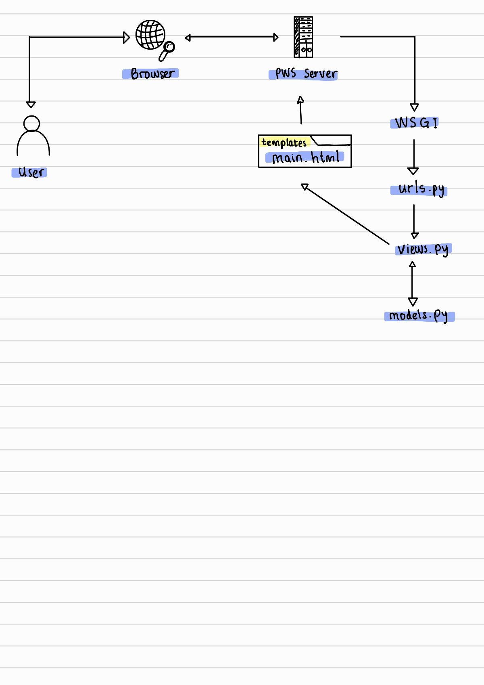

Depok Keebs
Tugas 2 PBP GSL 2024/2025
Link PWS: Depok Keebs

Pertanyaan 1
Jelaskan bagaimana cara kamu mengimplementasikan checklist di atas secara step-by-step (bukan hanya sekadar mengikuti tutorial):

Saya membuat direktori lokal di laptop saya bernama depok_keebs.
Saya membuat repository di Github dengan nama yang sama, yaitu depok_keebs.
Saya menginisiasi direktori lokal dengan git, kemudian menambahkan remote repository depok_keebs agar terhubung dengan repository lokal.
Saya membuat file-file syarat seperti .gitignore dan README.md, kemudian menginstall dependencies.
Setelah memulai virtual environment, saya membuat project Django baru dengan django-admin startproject depok_keebs ..
Saya memulai app baru bernama main dengan python manage.py startapp main.
Saya meng-include aplikasi dan URL main pada settings.py dan urls.py di direktori project, setelah itu juga menambahkan URL pada level aplikasi main, sehingga Django bisa me-handle pola URL yang akan diberikan.
Saya membuat direktori templates di dalam direktori main, lalu membuat main.html yang berisi template data diri dan nama aplikasi untuk menampilkan layout page pada web PWS.
Saya membuat model Product dengan beberapa atribut, yaitu name, price, description, category, connection_type, dan layout.
Setelah models.py selesai dikerjakan, saya melakukan migrasi models.
Pada views.py dalam aplikasi main, saya mengimplementasikan fungsi untuk menampilkan template HTML.
Saya membuat project baru pada PWS lalu menambahkan git remote PWS pada direktori lokal saya.
Setelah direktori lokal selesai saya kerjakan, saya melakukan commit dan push perubahan ke Github repository depok_keebs dan juga PWS.
Project PWS selesai build, kemudian saya melengkapi README.md pada Github repository.
Pertanyaan 2
Buatlah bagan yang berisi request client ke web aplikasi berbasis Django beserta responnya dan jelaskan pada bagan tersebut kaitan antara urls.py, views.py, models.py, dan berkas HTML:

User mengirim HTTP request ke PWS server yang diteruskan ke WSGI server.
WSGI server meneruskan ke Django.
Oleh urls.py, HTTP request dihubungkan ke views.py.
Selanjutnya, views.py memproses request dan fetch data dari models.py.
views.py mengirimkan response HTTP berupa template main.html kembali pada User.
Pertanyaan 3
Jelaskan fungsi git dalam pengembangan perangkat lunak:

Git berfungsi sebagai version control dalam pengembangan perangkat lunak. Dengan Git, kita dapat melacak setiap perubahan kode yang dilakukan, memudahkan proses kolaborasi, dan memungkinkan rollback ke versi sebelumnya jika terjadi kesalahan.

Pertanyaan 4
Menurut Anda, dari semua framework yang ada, mengapa framework Django dijadikan permulaan pembelajaran pengembangan perangkat lunak:

Dengan arsitektur Model-View-Template (MVT) yang terstruktur, framework ini membantu pemula memahami konsep dasar pengembangan web sambil mengajarkan praktik terbaik dalam hal keamanan, manajemen database, dan skalabilitas. Selain itu, komunitasnya yang besar juga menyediakan dukungan dan sumber daya yang melimpah terutama bagi mahasiswa yang memulai pembelajaran ini.

Pertanyaan 5
Mengapa model pada Django disebut sebagai ORM:

Object-Related-Mapping, atau sebuah teknik untuk me-convert sebuah object menjadi object pada sistem lain. Models pada Django disebut sebagai ORM karena Django memiliki peran sebagai interface di antara object pada Python dengan table pada SQL. Ini memungkinkan pengembang untuk berinteraksi dengan database tanpa harus menulis query SQL secara eksplisit, melalui QuerySet API yang disediakan oleh Django.
